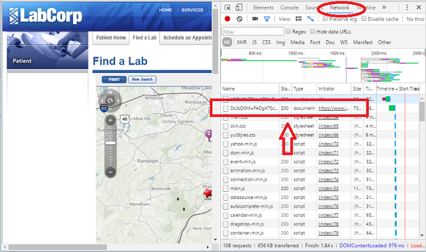
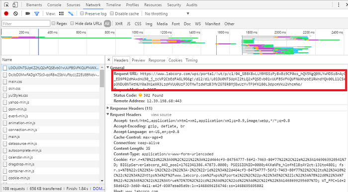

The purpose of this document is to explain the workflow used to create the <code>LabLocations</code> dataset of LabCorp lab locations. Some of the steps in this process require manual inputs from the user so cannot be built into functions. One of the goals of this document is to ensure the process is understandable and reproducible. 


```{r}
library(LabCorp)
```

### Step 1: Create a Search URL
We want the addresses for all of LabCorp's labs in a format we can use for plotting and future geographic analysis. The first step is to query their website so that it returns data on a few labs in small area and repeat the process until we've covered the entire US. 

The LabCorp website has a search feature where you can enter criteria such as an address or zip code and the site will serve up the labs in that area.  When you click the search button, the site encodes the search criteria and a referer into a single URL and sends it to the server. This URL is called the request because the user is requesting information from the server. The server sends a response to the request. The referer is a tool for the server to track where request originates from and to validate that it's a valid request. It could change based on when you do the search or where you are searching from.  

Great, so how do we get the referer?  We run the search manually once and get the referer using Chrome's developer tools.  Here's how: 

1. Open Google Chrome and navigate to [http://www.labcorp.com](http://www.labcorp.com). 
2. Right click anywhere on the page and click the 'Inspect' menu option. This will open the developer tools.
3. Click the Network menu at the top of the developer tools. This menu captures a log of requests to and responses from the server.  Make sure the log is clear before proceeding. 
4. Use the form to search for a lab.  Enter a zip code, state or some other query parameter and click the search button. You should see a the network log populate as the website refreshes.  
5. Scroll to the top of the log and click the first event.



6. With this screen open, you can see the request URL. The refer is buried in this request URL so you'll have to cut it out yourself.  The referal starts after the base URL so make sure to cut out the 'www.labcorp.com'.



```{r, tidy=F}
referer<-paste0("/wps/portal/!ut/p/c1/04_SB8K8xLLM9MSSzPy8xBz9CP0os",
                "_hACzO_QCM_IwMLo1ALAyNj1yBnQxNfAwN_U6B8JG55AyMCuv0",
                "88nNT9SP1o8zjQ11Ngg09LY0N_M3DjA08DcPcfFwcjQwNgk30Q",
                "_QjnYGKIvEqKsiNKDfUDVQEAO_Izxc!/dl2/d1/L0lJWm1abVp",
                "tS0NsRS9vQXdRQUVFVUFBQ0FDeFFBQUlCQWxBQUFnREtVQUFDQ",
                "VlaUUFBSUFqbEFBQWdDQlVBQUNBQWxRQUFJQUJWQUFBZ0FORzB",
                "heEFBQWdHZ0EhIS9ZSTUwc3V5bHdBISEvN19VRTRTMUk5MzBPN",
                "1YzMEkxVkZMREEyMTBTNC9zZWFyY2g!/")

library(zipcode)
data(zipcode)
zips<-as.list(zipcode$zip)
names(zips)[1:length(zips)]<- "zipCode"
URLs<- sapply(1:9, function(x) makeurl(params=zips[x], referer=referer))
```

###Step 2: Setup the File
The scaping process will use a lot of RAM. On my machine, I kept getting failures because the interim data was too big to handle with RAM. I was able to work around the failure by writing the interim results to a file and append to it with each iteration in step 3 below. This step simply sets up the file so it's ready to receive those results.  We create a .csv file and write the headers to it.  
```{r, eval=F}
head <- "lat,long,street,city,state,zip"
filename <- "LabCorp_PSC_Listing.csv"
writeLines(head,filename)
```

###Step 3: Capture the Data and Write to File  
This next step loops through the URLs we just created and collects the location data. The  GetLabData function pulls scrapes the raw html from the LabCorp website, extracts the latitude, longitude, and address data from a javascript function, and finally formats it into a dataframe. As I mentioned in Step 2, looping through the URLs like this seemed very memory intensive on my machine and my work around was to append the nterim data to a file  on each iteration. I know that loops are inefficient in R, and writing to a file requires I/O overhead, but at least this would method would run to completion.  Perhaps I could have run it on an AWS but I like to keep my processing local. 

```{r, eval=FALSE}
len<- length(URLs)
for (url in URLs){
  a<- GetLabData(url)
  if(!is.null(a)){
  suppressWarnings(
    write.table(a,
              filename,
              row.names = F,
              append=T,
              sep=",",
              col.names = F))
    }
  cat(paste0("Complete iteration: ",which(URLs==url)), " of ",len,"\n")
  }
```

###Step 4: Clean the Data  
The data we pulled in step 3 will include duplicate locations.  This is because a lab may be within the given radius from the center of more than one zipcode.  This lab would show up in the search results for each query and therefore be written to the file several times. We'll need to remove the duplicates so we only have unique locations. 

```{r, eval=FALSE}
dat<- read.csv(filename)
LabLocations<- unique(dat)
```
